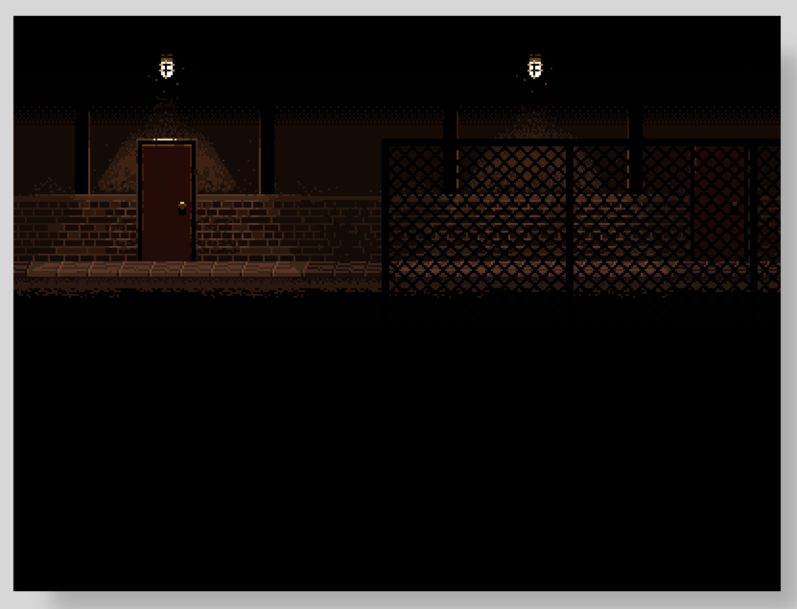

# Canvas API - Working With Images

A quick demo of how you can draw and work with image data when drawing images to your HTML `<canvas>` element.

For a detailed walkthrough, checkout my video on YouTube here:

Link to live demo:

[Demo](https://devshareacademy.github.io/code-examples-from-my-video-content/canavs-api/basic-image-example/index.html)

## Credit

The spritesheet that was used in this demo were created by [ansimuz](https://ansimuz.itch.io/grunge-horror-environment).
