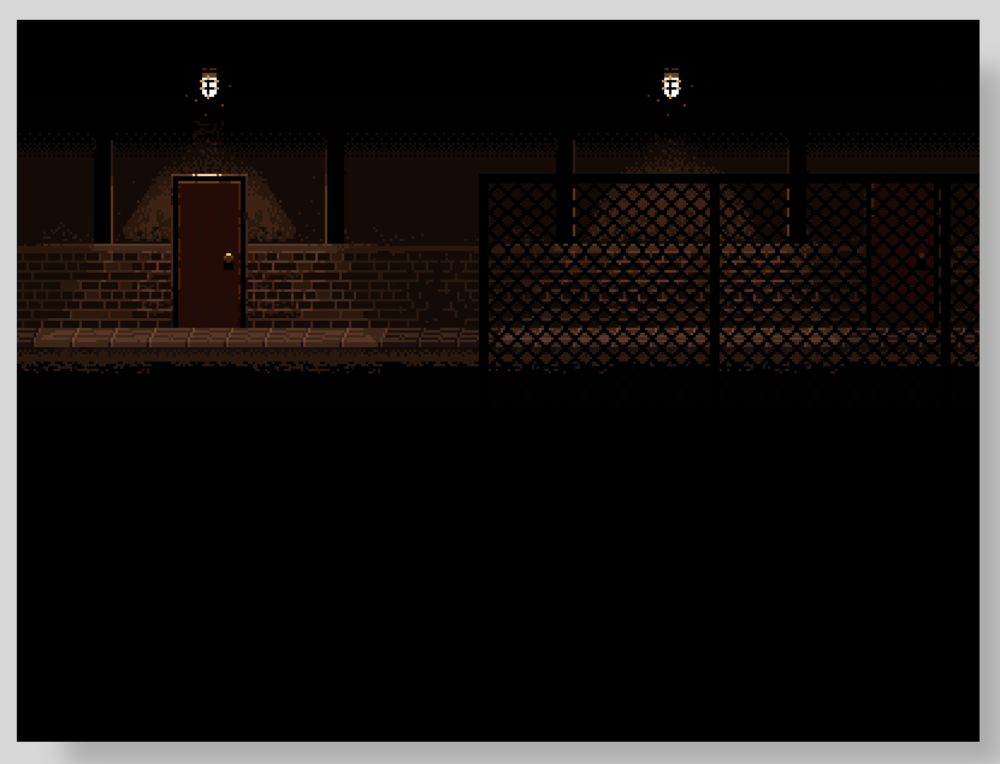

# Canvas API - Nine Slice Demo

A quick demo of how you can use the nine slice scaling technique with the Canvas API when drawing your images to the HTML `<canvas>` element.

For a detailed walkthrough, checkout my video on YouTube here:

Link to live demo:

[Demo](https://devshareacademy.github.io/code-examples-from-my-video-content/canavs-api/nine-slice-demo/index.html)

## Credit

The images used in this demo were created by:

- [bdragon1727](https://bdragon1727.itch.io/border-and-panels-menu-part-1)
- [kenney](https://www.kenney.nl/assets/ui-pack-space-expansion)
