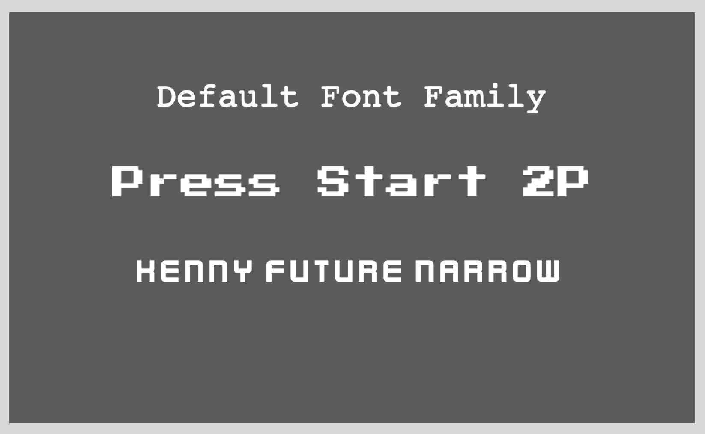

# Phaser 3 - Custom Fonts Demo

A quick demo of how you can easily use custom fonts in Phaser 3 by using the [Web Font Loader](https://github.com/typekit/webfontloader). With the Web Font Loader, you can use your own custom fonts, and use fonts from a provider like Google Fonts.

For a detailed walkthrough, checkout my video on YouTube here:

Link to live demo:
[Custom Fonts](https://devshareacademy.github.io/code-examples-from-my-video-content/phaser-3/custom-fonts/index.html)

## Credit

The custom fonts that were used in this demo were created by [Kenney](https://www.kenney.nl/assets/kenney-fonts).
