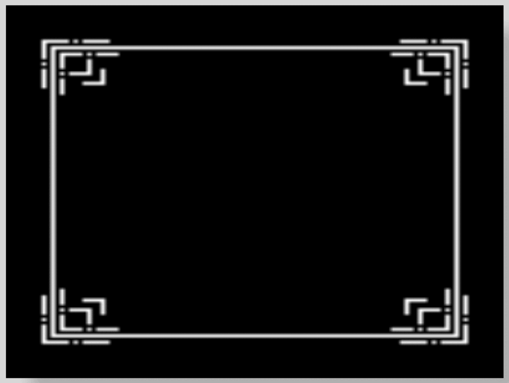

# Phaser 3 - Custom Nine Slice Demo

A quick demo of how you can build your own custom nine slice scaling functionality in Phaser 3 by using the built in Phaser 3 image and container game objects!

For a detailed walkthrough, checkout my video on YouTube here:

Link to live demo:

[Custom Nine Slice Demo](https://devshareacademy.github.io/code-examples-from-my-video-content/phaser-3/3.60/custom-nine-slice/index.html)

## Credit

The images used in this demo were created by:

- [bdragon1727](https://bdragon1727.itch.io/border-and-panels-menu-part-1)
- [kenney](https://www.kenney.nl/assets/ui-pack-space-expansion)
