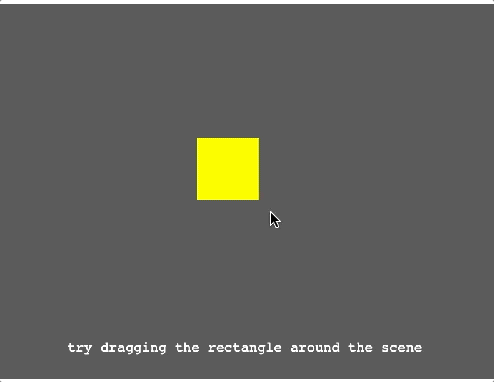

# Phaser 3 - Draggable Game Objects With Pointer Events Demo

A quick demo of how you can use the built in touch events of Phaser 3 to allow you to drag game objects in your Phaser 3 Scene.

For a detailed walkthrough, checkout my video on YouTube here:

Link to live demo:

[Draggable Game Objects Demo](https://devshareacademy.github.io/code-examples-from-my-video-content/phaser-3/drag-game-objects/index.html)
