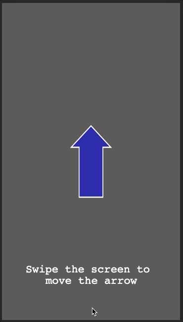

# Phaser 3 - Mobile Swipe Demo

A quick demo of how you can use the built in touch events of Phaser 3 to handle swipe gestures! By using the these built in events, you can easily enhance your game to support mobile devices.

For a detailed walkthrough, checkout my video on YouTube here:

Link to live demo:

[Mobile Swipe Demo](https://devshareacademy.github.io/code-examples-from-my-video-content/phaser-3/mobile-swipe/index.html)
