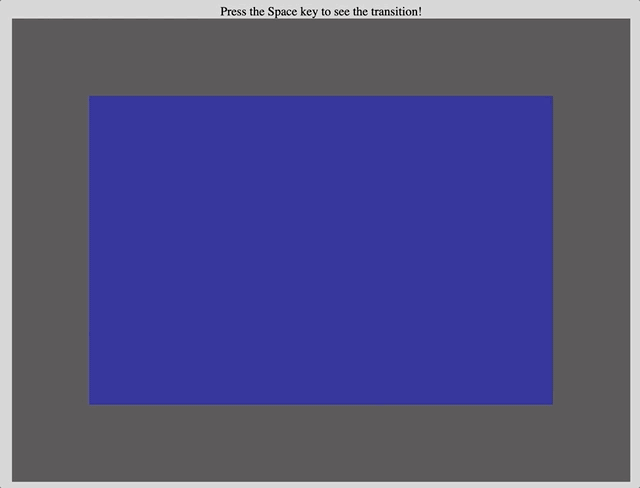

# Phaser 3 - Simple Scene Transitions Demo

A quick demo of how you can use the built in events of Phaser 3 to know when an animation is completed, that way you can use that event to perform some additional game logic.

For a detailed walkthrough, checkout my video on YouTube here:

Link to live demo:

[Simple Scene Transitions](https://devshareacademy.github.io/code-examples-from-my-video-content/phaser-3/simple-scene-transitions/index.html)
