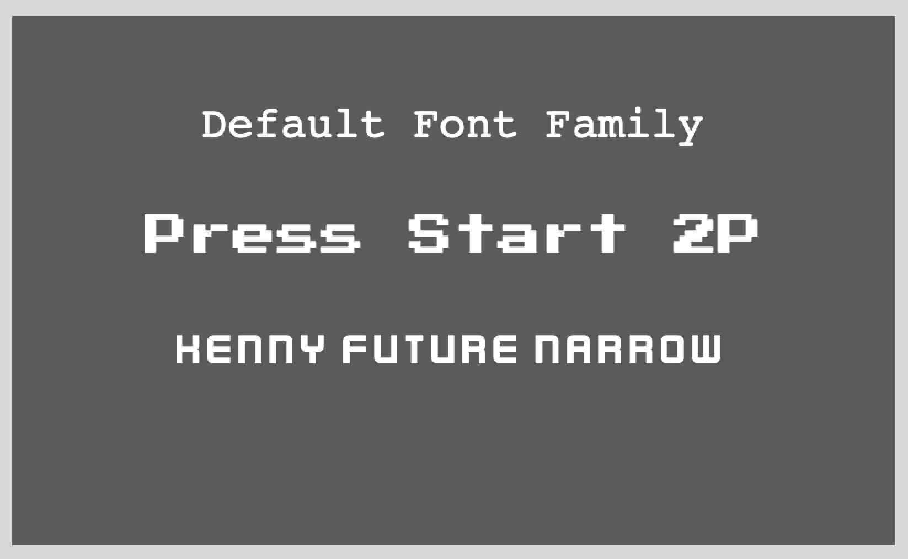

# Phaser 3 - Custom Fonts With Native Phaser

A quick demo of how you can easily use custom fonts in Phaser 3 by using the new `FontFile` Loader! This new loader is available in Phaser `3.87.0`, and it has support for `TTF/OTF` out of the box, so you no longer need to use a 3rd party font loader.

For a detailed walkthrough, checkout my video on YouTube here:

Coming soon...

Link to live demo:

[Custom Fonts](https://devshareacademy.github.io/code-examples-from-my-video-content/phaser-3/native-custom-fonts/index.html)

## Credit

The custom fonts that were used in this demo were created by [Kenney](https://www.kenney.nl/assets/kenney-fonts) and [CodeMan38](https://fonts.google.com/?query=CodeMan38).
